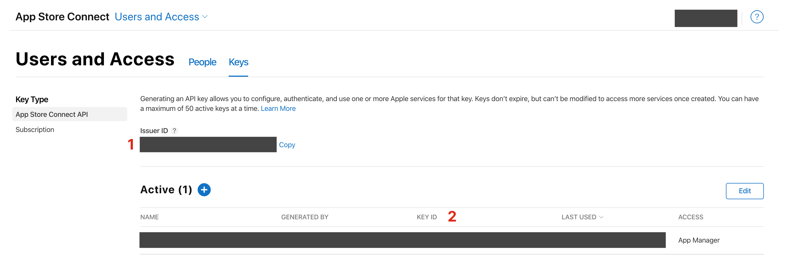

A guide on notarizing Electron apps for macOS with `electron-builder`

<!--more-->

With the release of macOS Catalina (10.15), Apple made app hardening and notarization mandatory for apps distributed outside the Mac App Store.

Like app sandboxing, the **Hardened Runtime** is a security feature that restricts your app from utilizing certain system features. Exceptions can also be defined using code signing entitlements.

**Notarization** is an automated security check by Apple, which involves their servers scanning your app for malicious content and code signing issues. App notarization requires your app to use the Hardened Runtime.

Thankfully, hardening and notarizing Electron apps has become a pretty simple process. This tutorial assumes that [you've already set up `electron-builder`]() in your project. The build tool can be configured to harden your app for you, and the [`electron-notarize`](https://github.com/electron/electron-notarize) and [`electron-builder-notarize`](https://github.com/karaggeorge/electron-builder-notarize) packages can take care of notarizing your app:

- `electron-builder` builds and signs your app to use the Hardened Runtime
- `electron-notarize` wraps Apple's `altool` CLI and uses it to notarize your app
- `electron-builder-notarize` wraps `electron-notarize` and simplifies its usage with `electron-builder`

### App Configuration

To get started, install `electron-builder-notarize` in your Electron app:

```sh
yarn add --dev electron-builder-notarize
```

To get notarization to work, add the following options in your `package.json` file:

package.json

```json
{
	"build:": {
		"afterSign": "electron-builder-notarize",
		"mac": {
			"hardenedRuntime": true
		}
	}
}
```

Next, create or update your `build/entitlements.mac.plist` file with the following code signing entitlements, which are required for Electron to work:

```xml
<?xml version="1.0" encoding="UTF-8"?>
<!DOCTYPE plist PUBLIC "-//Apple//DTD PLIST 1.0//EN" "http://www.apple.com/DTDs/PropertyList-1.0.dtd">
<plist version="1.0">
	<dict>
		<key>com.apple.security.cs.allow-jit</key>
		<true/>
		<key>com.apple.security.cs.allow-unsigned-executable-memory</key>
		<true/>
		<key>com.apple.security.cs.allow-dyld-environment-variables</key>
		<true/>
	</dict>
</plist>
```

### Authentication

Now, you'll want to give `electron-builder-notarize` permission to notarize your app. A secure way to do so is using the App Store Connect API.

1. Sign in to App Store Connect and open the [API key page](https://appstoreconnect.apple.com/access/api)
2. Create a new API key by clicking on the "+" symbol. Set access permissions to "App Manager"
3. Download the key file and move it into the `~/private_keys/` directory, where `altool` will be able to find it
4. Copy your Issuer ID (1) and Key ID (2):



### Notarization

If you pass the credentials you just copied as environment variables to `electron-builder`, your app should be built and notarized successfully:

```sh
API_KEY_ID="..." API_KEY_ISSUER_ID="..." yarn run electron-builder --mac
```

Please note that the notarization process might take a few minutes.

To avoid your API information being visible in the terminal history, you can use a package like [dotenv](https://github.com/motdotla/dotenv) to read your environment variables from a file instead.

### Sources

- [`electron-notarize` docs](https://github.com/electron/electron-notarize)
- [Notarizing your Electron application](https://kilianvalkhof.com/2019/electron/notarizing-your-electron-application)
