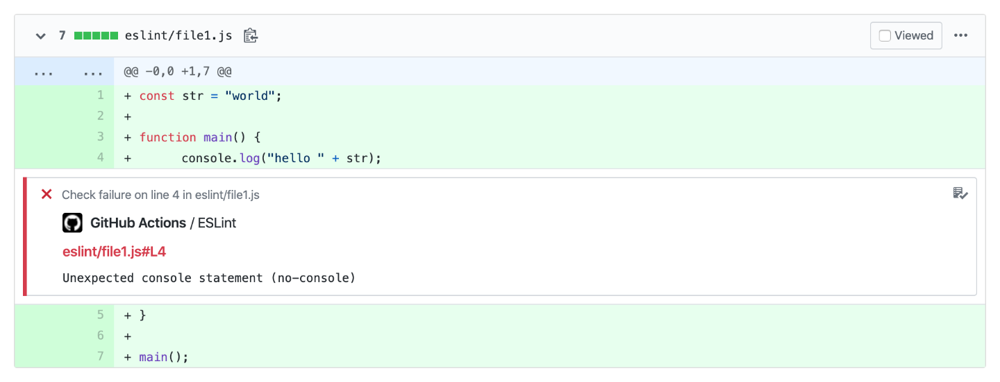
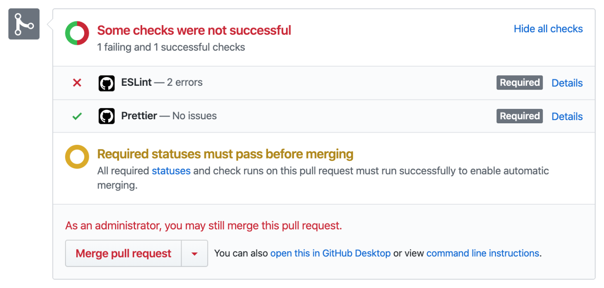
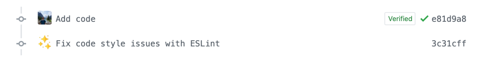

Using GitHub Actions to enforce clean code in JavaScript, Python, Ruby, Go and Swift projects

<!--more-->

Linters are important tools for detecting potential errors and maintaining a consistent code style in a project. Unfortunately, it can happen that a contributor creates commits without running the linter first and that style violations are merged.

To make sure that contributions are linted, the code analysis can be performed as part of a CI pipeline. Merging can even be blocked as long as linting errors are unresolved.

With [Actions](https://github.com/features/actions), GitHub launched their own CI service last year. By setting up my **[Lint Action](https://github.com/samuelmeuli/lint-action)**, GitHub Actions can be used to lint code whenever a change is pushed. The action not only shows the **lint result on commits and PRs** but also creates inline **code annotations for each linting error**:



These annotations, together with the action's **auto-fix feature**, make it easy for both maintainers and contributors to keep the code style in a repository consistent.

### Using the Lint Action

To enable the Lint Action in your repository, create a GitHub Actions workflow in the `.github/workflows/` directory (e.g. named `lint.yml`). The file should use a structure similar to the following:

```yml
name: Lint

on: push

jobs:
  run-linters:
    name: Run linters
    runs-on: ubuntu-latest

    steps:
      - name: Check out Git repository
        uses: actions/checkout@v2

      # TODO: Install your linters here

      - name: Run linters
        uses: samuelmeuli/lint-action@v1
        with:
          github_token: ${{ secrets.github_token }}
          # TODO: Enable your linters here
```

The Lint Action supports linters and formatters for a variety of programming languages:

- **CSS** (stylelint)
- **Go** (`gofmt`, `golint`)
- **JavaScript** (ESLint, Prettier)
- **Python** (Black, Flake8, Mypy)
- **Ruby** (RuboCop)
- **Swift** (SwiftFormat, SwiftLint)

Furthermore, the action can easily be extended to support other languages and tools. A contributing guide can be found [here](https://github.com/samuelmeuli/lint-action#development).

### Showing Lint Errors on Commits/PRs

For the Lint Action to work, you first need to install the linters you wish to use on the virtual machine. The following example shows how this is done for Python. Code is linted with Flake8 and formatted with Black:

```diff
  name: Lint

  on: push

  jobs:
    run-linters:
      name: Run linters
      runs-on: ubuntu-latest

      steps:
        - name: Check out Git repository
          uses: actions/checkout@v2

-       # TODO: Install your linters here
+       - name: Set up Python
+         uses: actions/setup-python@v1
+         with:
+           python-version: 3.8
+
+       - name: Install Python dependencies
+         run: pip install black flake8

        - name: Run linters
          uses: samuelmeuli/lint-action@v1
          with:
            github_token: ${{ secrets.github_token }}
-           # TODO: Enable your linters here
+           black: true
+           flake8: true
```

The approach is the same for other programming languages and linters. You can find more examples [in the action's docs](https://github.com/samuelmeuli/lint-action#examples).

### Viewing Lint Results

Every time somebody pushes to your repository, the action will now lint the project. Using GitHub's [Check Runs API](https://developer.github.com/v3/checks/runs), the commit will be annotated with the lint result. You can even inspect the specific lines of code where style violations were found.

If the commit is part of a pull request, GitHub will automatically pick up the latest check and display it in a user-friendly way, showing the committer or maintainer whether the PR requires further inspection before a merge can be made:



### Auto-fixing Errors

Besides showing lint errors, the Lint Action can also fix some of the issues automatically. This is done by running the linter commands with the corresponding auto-fix arguments and creating a bot commit of the changed files.



Setting up auto-fixing is easy: All you need to do is set the action's `auto_fix` option to `true`.

The `auto_fix` value can also be determined dynamically using [GitHub Actions' expression syntax](https://help.github.com/en/actions/automating-your-workflow-with-github-actions/contexts-and-expression-syntax-for-github-actions). For instance, you might not want any auto-fix commits on your `master` branch. To only create such bot commits on PR branches, you can configure the action as follows:

```diff
  name: Lint

- on: push
+ on: [push, pull_request]

  jobs:
    run-linters:
      name: Run linters
      runs-on: ubuntu-latest

      steps:
        - name: Check out Git repository
          uses: actions/checkout@v2

        - name: Set up Python
          uses: actions/setup-python@v1
          with:
            python-version: 3.8

        - name: Install Python dependencies
          run: pip install black flake8

        - name: Run linters
          uses: samuelmeuli/lint-action@v1
          with:
            github_token: ${{ secrets.github_token }}
+           auto_fix: ${{ github.event_name == 'pull_request' }}
            black: true
            flake8: true
```

_Please note that GitHub Actions currently has limitations with `pull_request` events triggered by forks. See [this issue](https://github.com/samuelmeuli/lint-action/issues/13) for details._

### Making Checks Mandatory

After your checks have run for the first time, you can choose to make them a requirement for pull requests and block merging while there are linting errors. You can configure this in your repository settings under "Branches" → "Add rule" → "Require status checks to pass before merging".
